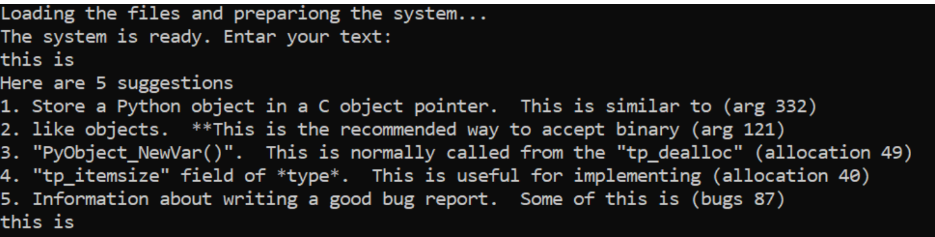

"# google-project-group-5" 

<h1>Autocomplete for Sentences</h1>

<h3>Purpose</h3> 

Enables completion
of sentences from articles, documentation and information files on various technological topics.

<h3>Used Technologies</h3>

Language - Python 3

IDE - PyCharm

<h3>Challenges</h3>

For offline mode running time was not a factor,
we focused on create the database in a way that allow us to access the data in the most efficient way (in terms of time complexity) in Online mode. 
We used hash map as the main database.
In the future we aspire to accomplish better running time for offline mode.

For online mode we focused in efficiency in terms of time complexity.
We tried to reach a maximum time complexity of log(n).
In the future we aspire to reach time complexity of O(1).
Also, we need to improve the accuracy of the output, we have unhandled edge cases.

<h3>How to Install and Run the Project</h3>

Download Python 3. 
Open cmd and navigate to the project folder and run the command "python main.py".

<h3>How to Use the Project</h3>
Enter any wanted prefix or complete words or sentences to search for.
Then you'll get an output which provides the best 5 matches for your search.
Then you will be able to continue typing your search and press enter to get an output.
If you'd like to restart the search, enter '#'.

